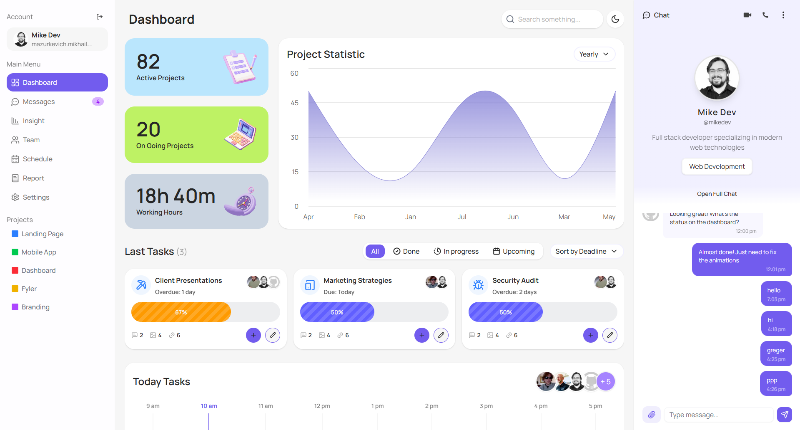
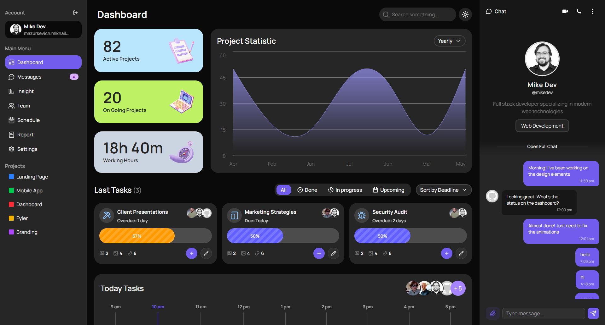
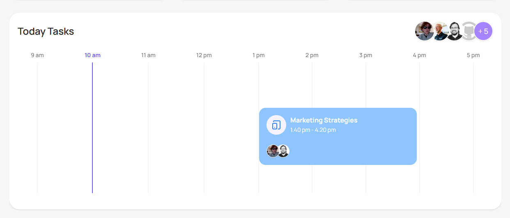
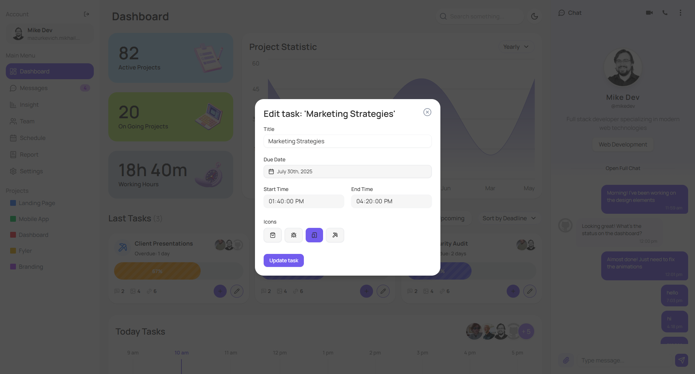
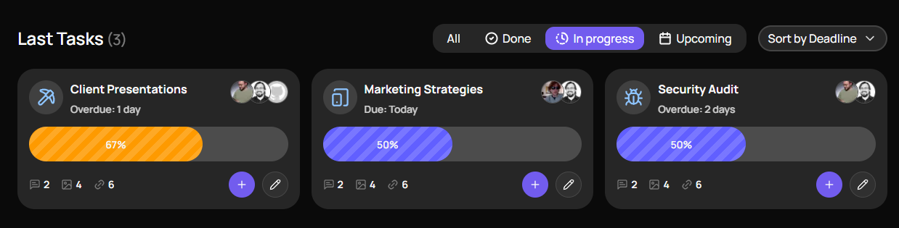
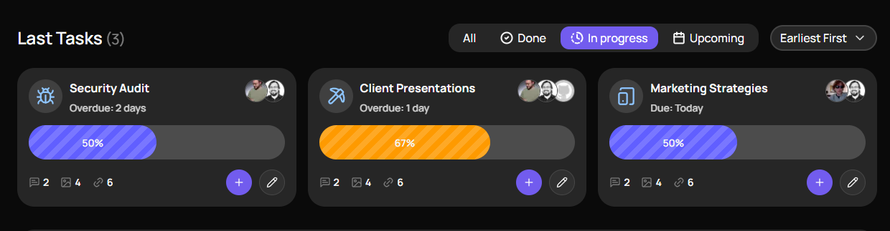

# 🚀 TaskHub - Modern Task Management Platform

> **A sleek, fast, and intuitive task management application built during the RED Summer 2025 marathon**

[](https://nextjs.org/)
[](https://www.typescriptlang.org/)
[](https://supabase.com/)
[](https://tailwindcss.com/)
=======
[](https://nextjs.org/)
[](https://www.typescriptlang.org/)
[](https://supabase.com/)
[](https://tailwindcss.com/)
>>>>>>> ed6712b (feature: add task creating)
[](LICENSE)
[](https://github.com/yourusername/taskhub)

---

## ✨ Features

- 🎯 **Project-based Task Organization** - Group and manage tasks by projects
- 📊 **Task Status Tracking** - Monitor progress with visual indicators
- 🔄 **Real-time Sync** - Data synchronization via Supabase
- 📱 **Responsive Design** - Works seamlessly on all devices
- 🌙 **Dark/Light Theme** - Beautiful theme switching
- 🚀 **Modern UI/UX** - Clean, intuitive interface
- ⚡ **Fast Performance** - Built with Next.js 14 and optimized for speed

---

## 🖼️ Screenshots

| Dashboard (Light)                                          | Dashboard (Dark)                                         | Timeline View                                |
| ---------------------------------------------------------- | -------------------------------------------------------- | -------------------------------------------- |
|  |  |  |

=======
| Task Management                                       | Project Statistics                                      | Mobile View                                                   |
| ----------------------------------------------------- | ------------------------------------------------------- | ------------------------------------------------------------- |
|  |  |  |

>>>>>>> ed6712b (feature: add task creating)
---

## 🛠️ Tech Stack

### Frontend

- **Framework**: [Next.js 14](https://nextjs.org/) with App Router
- **Language**: [TypeScript](https://www.typescriptlang.org/)
- **Styling**: [Tailwind CSS](https://tailwindcss.com/) + [shadcn/ui](https://ui.shadcn.com/)
- **State Management**: Zustand
- **Icons**: Lucide React

### Backend & Database

- **Database**: [Supabase](https://supabase.com/) (PostgreSQL)
- **Authentication**: Supabase Auth
- **Real-time**: Supabase Realtime
- **API**: Next.js API Routes

### Development Tools

- **Package Manager**: [Bun](https://bun.sh/)
- **Linting**: ESLint
- **Formatting**: Prettier
- **Type Checking**: TypeScript

---

## 🚀 Getting Started

### Prerequisites

- Node.js 18+ or [Bun](https://bun.sh/)
- Supabase account

### Installation

1. **Clone the repository**

   ```bash
   git clone https://github.com/yourusername/taskhub.git
   cd taskhub
   ```

2. **Install dependencies**

   ```bash
   bun install
   # or
   npm install
   ```

3. **Set up environment variables**

   ```bash
   cp .env.example .env.local
   ```

   Fill in your Supabase credentials:

   ```env
   NEXT_PUBLIC_SUPABASE_URL=your_supabase_url
   NEXT_PUBLIC_SUPABASE_ANON_KEY=your_supabase_anon_key
   SUPABASE_SERVICE_ROLE_KEY=your_service_role_key
   ```

4. **Run the development server**

   ```bash
   bun dev
   # or
   npm run dev
   ```

5. **Open your browser**
   Navigate to [http://localhost:3000](http://localhost:3000)

---

## 📁 Project Structure

```
taskhub/
├── src/
│   ├── app/                 # Next.js app router
│   ├── components/          # Reusable UI components
│   ├── sections/            # Page sections and features
│   ├── services/            # API and external services
│   ├── store/               # State management
│   ├── types/               # TypeScript type definitions
│   └── utils/               # Utility functions
├── public/                  # Static assets
├── supabase/                # Database configuration
└── components.json          # shadcn/ui configuration
```

---

## 🗺️ Roadmap

| Feature                   | Status         | Priority | ETA     |
| ------------------------- | -------------- | -------- | ------- |
| 🔐 User Authentication    | ✅ Complete    | High     | -       |
| 📋 Basic Task Management  | ✅ Complete    | High     | -       |
| 🎯 Project Organization   | ✅ Complete    | High     | -       |
| 📊 Task Statistics        | ✅ Complete    | Medium   | -       |
| 💬 Team Chat              | 🚧 In Progress | Medium   | Q2 2025 |
| 📱 Mobile App             | 📋 Planned     | Low      | Q3 2025 |
| 🔔 Push Notifications     | 📋 Planned     | Medium   | Q2 2025 |
| 📈 Advanced Analytics     | 📋 Planned     | Low      | Q4 2025 |
| 🔗 API Integration        | 📋 Planned     | Medium   | Q3 2025 |
| 🌍 Multi-language Support | 📋 Planned     | Low      | Q4 2025 |

---

## 🤝 Contributing

We welcome contributions from the community! Here's how you can help:

### 🐛 Reporting Bugs

- Use the [GitHub Issues](https://github.com/yourusername/taskhub/issues) page
- Include detailed steps to reproduce the bug
- Add screenshots if applicable

### 💡 Suggesting Features

- Open a [Feature Request](https://github.com/yourusername/taskhub/issues/new?template=feature_request.md)
- Describe the feature and its benefits
- Consider implementation complexity

### 🔧 Contributing Code

1. Fork the repository
2. Create a feature branch (`git checkout -b feature/amazing-feature`)
3. Make your changes
4. Add tests if applicable
5. Commit your changes (`git commit -m 'Add amazing feature'`)
6. Push to the branch (`git push origin feature/amazing-feature`)
7. Open a Pull Request

### 📝 Code Style

- Follow the existing code style
- Use TypeScript for all new code
- Add proper JSDoc comments
- Ensure all tests pass

---

## 📄 License

This project is licensed under the MIT License - see the [LICENSE](LICENSE) file for details.

---

## ⭐ Star This Repository

If TaskHub has been helpful to you, please consider giving it a star! ⭐

[](https://github.com/mikemaz-dev/taskhub)
=======
[](https://github.com/yourusername/taskhub)
>>>>>>> ed6712b (feature: add task creating)

---

## 🙏 Acknowledgments

- Built during the **RED Summer 2025** marathon
- Inspired by modern task management tools
- Thanks to all contributors and the open-source community

---

**Made with ❤️ during RED Summer 2025**

[](https://red-summer-2025.com)

</div>
