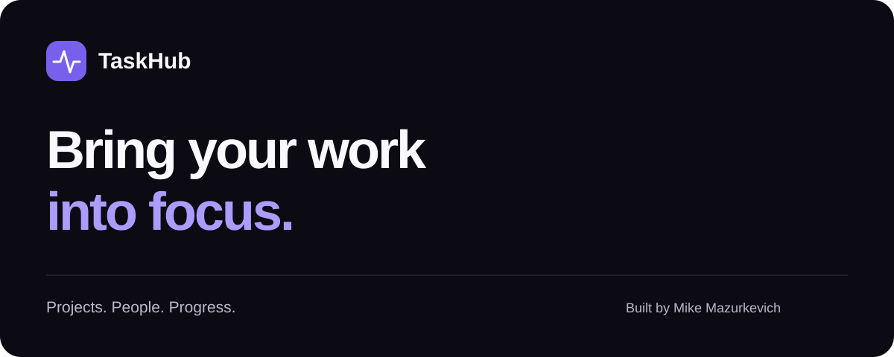

<div align="center">

# TaskHub

**A focused workspace for projects, people, and the next thing to do.**

[Open TaskHub](https://taskhub-green.vercel.app/) · [Getting started](docs/SETUP.md) · [Architecture](docs/ARCHITECTURE.md) · [User guide](docs/USER-GUIDE.md) · [Contributing](docs/CONTRIBUTING.md)


</div>

## What you can do

- Organize projects, plan tasks, assign teammates, and track checklist progress.
- Switch between daily, weekly, and monthly schedules.
- Explore workload and export date-filtered reports as CSV or print/PDF.
- Invite collaborators, manage owner/admin/member permissions, and exchange private messages.
- Read activity notifications and restore completed or archived projects.
- Personalize your profile, avatar, theme, and accent color.

TaskHub uses real accounts. Settings offers an optional personal sample workspace
with removable demo projects, tasks and checklist steps. Apply the demo migration
first; see [sample data](docs/DEMO-WORKSPACE.md).

## Project story

TaskHub started during a development marathon. After the marathon, I continued developing it with a redesigned interface, expanded collaboration features, and a more maintainable architecture.

## Built with intention

| Experience | Implementation |
| --- | --- |
| A consistent workspace | Custom date/time controls, light and dark themes, accent colors |
| Real collaboration | Supabase Auth, row-level permissions, private conversations and unread counts |
| Clear planning | A full-day scrollable schedule, task steps and project lifecycle controls |
| Maintainable code | Small feature components, ordered CSS modules and documented data boundaries |

## Run locally

Requires Node.js **20.9+**, Bun **1.3.14**, and the configured Supabase schema.

```sh
bun install --frozen-lockfile
cp .env.example .env.local
# Add your Supabase project URL and public anon key.
bun dev
```

Open [localhost:3000](http://localhost:3000). Follow the [setup guide](docs/SETUP.md) for authentication, storage, and database requirements. The repository contains incremental migrations for an existing database, not a complete fresh-install baseline.

## Documentation

| Guide | Contents |
| --- | --- |
| [Setup](docs/SETUP.md) | Environment, authentication, migrations, local development |
| [Architecture](docs/ARCHITECTURE.md) | Routing, component boundaries, data flow, CSS, dependencies |
| [Database](docs/DATABASE.md) | Entities, permissions, RPCs, realtime, migration order |
| [User guide](docs/USER-GUIDE.md) | Projects, tasks, messaging, analytics, keyboard shortcuts |
| [UI guidance](docs/UI.md) | Design tokens, file limits, accessibility, shared help text |
| [Contributing](docs/CONTRIBUTING.md) | Commands, review expectations, testing, upgrades |
| [Deployment](docs/DEPLOYMENT.md) | Production configuration, validation, rollback |

## Quality checks

```sh
bun run check:structure
bun run typecheck
bun run lint
bun test
bun run build
```

## Project history

Created during the RED Summer 2025 marathon and developed into a collaborative workspace by [Mike Mazurkevich](https://mikemaz-portfolio.vercel.app/ru). Original visual inspiration: [Task Management Web App](https://dribbble.com/shots/25947726-Task-Management-Web-App-UI-Design).

Licensed under [MIT](LICENSE).
